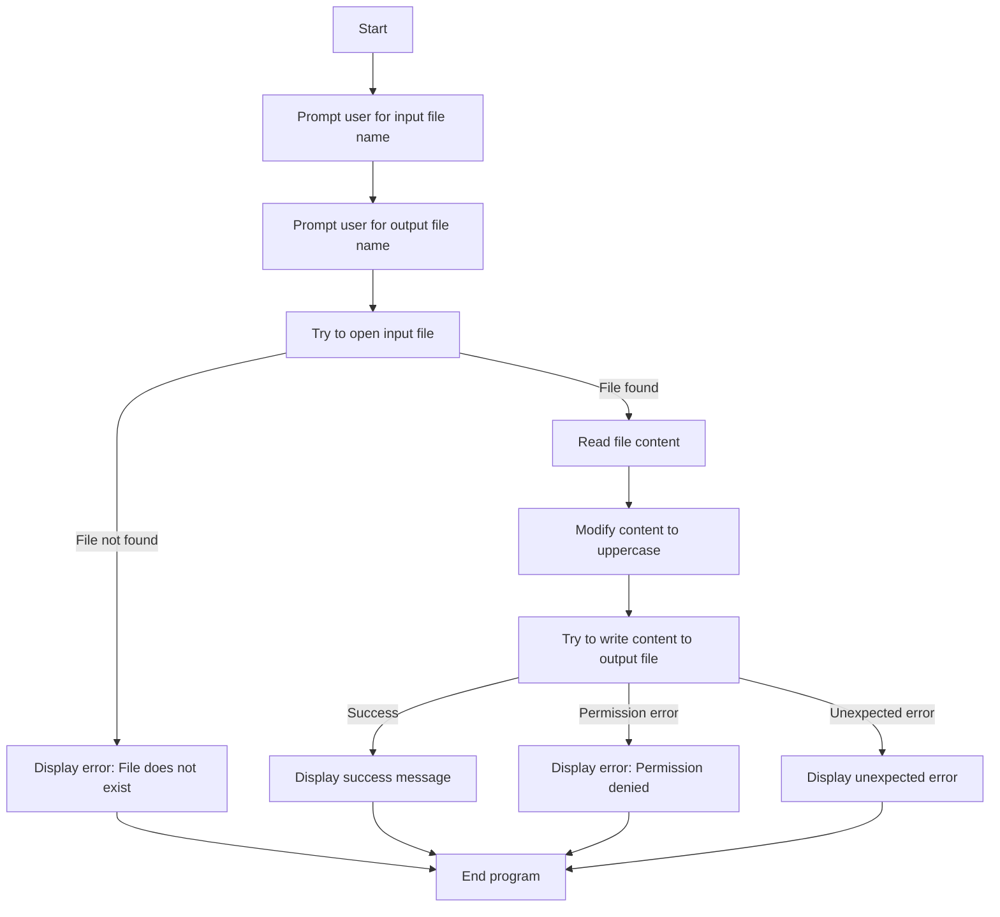

# Week-4-File-Handling-and-Exception-Handling

File Read & Write Challenge 🖋️: Create a program that reads a file and writes a modified version to a new file.
Error Handling Lab 🧪: Ask the user for a filename and handle errors if it doesn’t exist or can’t be read.
Outcomes 🎉

By the end of this module, you’ll be skilled in managing files efficiently in Python, ensuring error-free code that gracefully handles unexpected issues. Mastering files and exception handling will allow you to build strong, robust applications!


# 📝 File Read & Write: A Python Solution

This project is a simple yet powerful Python script that reads content from one file, modifies it, and writes it to another file. It includes robust error handling to ensure smooth operation even when things go wrong. 🚀

---

## 💡 Features

- Reads text from a user-specified file 📂
- Modifies the content (e.g., converts to **uppercase**) 🔠
- Writes the modified content to another user-specified file ✅
- Handles common errors like:
  - **File not found** 🛠️
  - **Permission errors** 🔒
  - **Unexpected errors** 💥

---

## 📜 Full Python Code

```python
def read_and_write_file():
    # Ask the user for the input and output filenames
    input_filename = input("Enter the filename to read from: ")
    output_filename = input("Enter the filename to write to: ")

    try:
        # Open the input file to read
        with open(input_filename, 'r') as file:
            content = file.read()

        # Modify the content (e.g., converting to uppercase)
        modified_content = content.upper()  # Example modification: convert to uppercase

        # Open the output file to write the modified content
        with open(output_filename, 'w') as file:
            file.write(modified_content)

        print(f"Content successfully written to {output_filename}")

    except FileNotFoundError:
        print(f"Error: The file '{input_filename}' does not exist.")
    except PermissionError:
        print(f"Error: You do not have permission to read or write the file '{input_filename}'.")
    except Exception as e:
        print(f"An unexpected error occurred: {e}")
```

# Call the function
read_and_write_file()
📊 Flowchart
Here’s a Mermaid diagram that visually represents the flow of the program:




## ⚙️ How to Use
Save the code to a file, e.g., file_read_write.py.

Open a terminal and navigate to the directory containing the script.

Run the script:

```bash
python file_read_write.py
```
Follow the prompts:

Enter the name of the file you want to read from (e.g., input.txt).
Enter the name of the file where you want the modified content to be saved (e.g., output.txt).
Check the output file for the modified content!

# 🛠️ Example Usage
Input File (input.txt):
```vbnet
This is a test file.
It contains sample text.
```
Output File (output.txt):
```vbnet
THIS IS A TEST FILE.
IT CONTAINS SAMPLE TEXT.
```

# 🔍 Error Handling Scenarios
File Not Found: If the input file doesn’t exist:

```javascript
Error: The file 'input.txt' does not exist.
Permission Denied: If you don’t have write permissions for the output file:
```

```arduino
Error: You do not have permission to read or write the file 'output.txt'.
Unexpected Error: If something else goes wrong:
```

```go
An unexpected error occurred: <error details>
```
# 🎓 What You’ll Learn
By exploring this project, you’ll gain experience in:

# Handling file I/O operations in Python 📂
Managing common errors gracefully with exception handling 🛠️
Writing clear, concise, and user-friendly scripts 🎉
## 📚 Additional Notes
Feel free to expand this program with more file transformations, such as:

Counting words or lines.
Replacing specific phrases.
Reformatting the content.

# 🤝 Contributions
Have an idea to improve this script? Fork the repository and submit a pull request! Contributions are always welcome. 💡

# 📜 License
This project is licensed under the MIT License. 📝


## Key Highlights of the `README.md`:
1. **Code inclusion**: The full Python code is included to make it self-contained.
2. **Mermaid Diagram**: Represents the program’s flow clearly and visually.
3. **Error Handling Scenarios**: Lists all possible errors for easy debugging.
4. **Learning Outcomes**: Adds value for developers seeking to improve their skills.
5. **Usage Examples**: Demonstrates real-world application with inputs and outputs.


```This `README.md` is designed to provide everything a user or developer might need to understand, use, and extend the project effectively! 🚀```


